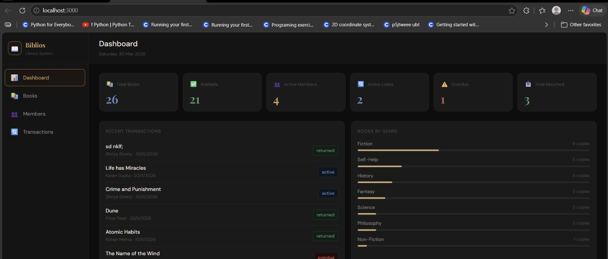
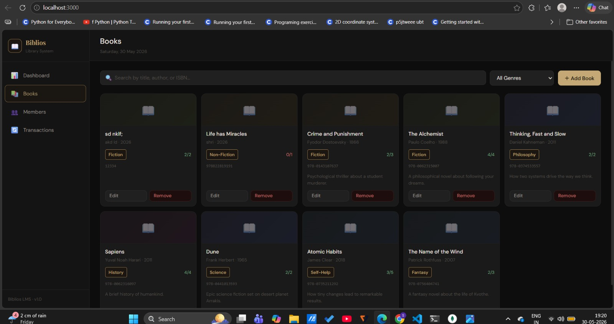
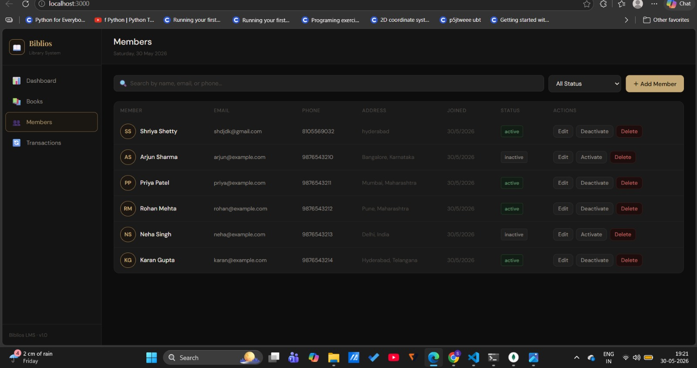
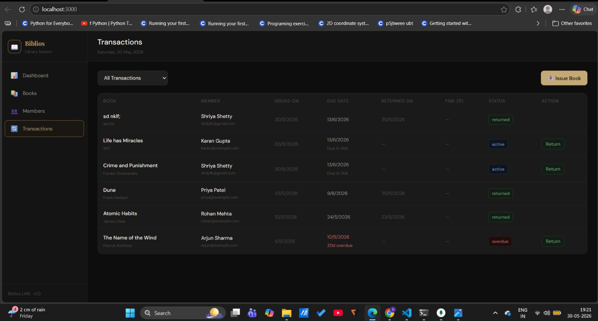
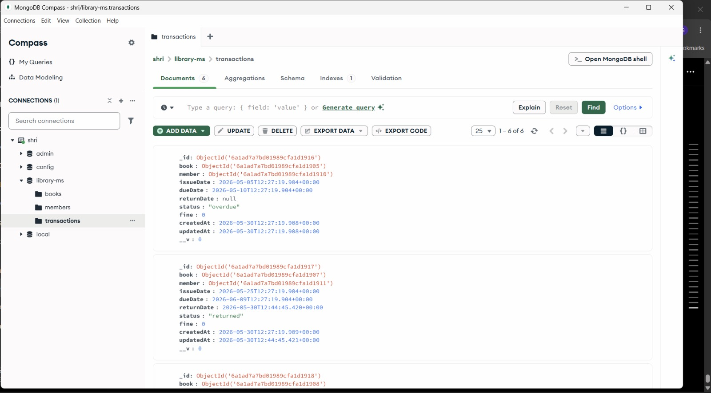

# 📚 Library Management System (MERN Stack)

A full-stack Library Management System built using **React.js**, **Node.js**, **Express.js**, and **MongoDB**. The application helps librarians manage books, members, and borrowing transactions efficiently while maintaining real-time inventory updates and transaction tracking.


---

## 🚀 Features

### 📚 Book Management

* Add new books
* Edit existing books
* Delete books
* Search books by title, author, or ISBN
* Filter books by genre
* Track total and available copies

### 👥 Member Management

* Register new members
* Edit member details
* Activate/Deactivate members
* Delete members
* View complete member records

### 🔄 Transaction Management

* Issue books to members
* Return books
* Automatic inventory updates
* Due date tracking
* Overdue loan monitoring
* Fine calculation (₹5/day overdue)

### 📊 Dashboard Analytics

* Total books
* Available books
* Active members
* Active loans
* Returned books
* Overdue books
* Recent transaction history
* Genre distribution insights

### 💾 Database Features

* MongoDB persistence
* Real-time data synchronization
* Structured collections for books, members, and transactions
* End-to-end CRUD operations

---

## 🏗️ System Architecture

```text
React Frontend
      │
      ▼
Express REST API
      │
      ▼
Node.js Backend
      │
      ▼
MongoDB Database
```

---

## 📂 Project Structure

```text
library-management-system/
│
├── backend/
│   ├── config/
│   ├── models/
│   ├── routes/
│   ├── seed/
│   ├── server.js
│   └── .env
│
├── frontend/
│   ├── public/
│   └── src/
│       ├── components/
│       ├── pages/
│       ├── utils/
│       ├── App.js
│       └── index.css
│
├── README.md
└── .gitignore
```

---

## 📸 Screenshots

### Dashboard


### Books Management


### Members Management


### Transactions Management


### MongoDB Database


## 🛠️ Tech Stack

| Layer             | Technologies                  |
| ----------------- | ----------------------------- |
| Frontend          | React.js, Axios, React Router |
| Backend           | Node.js, Express.js           |
| Database          | MongoDB, Mongoose             |
| Styling           | CSS3                          |
| Development Tools | Nodemon, MongoDB Compass      |

---

## ⚡ Installation & Setup

### Prerequisites

* Node.js (v18 or above)
* MongoDB Community Server
* MongoDB Compass (optional)

---

### 1️⃣ Clone the Repository

```bash
git clone https://github.com/Shriyashetty0510/library-management-system.git
cd library-management-system
```

### 2️⃣ Start MongoDB

Ensure MongoDB is running locally on:

```text
mongodb://localhost:27017
```

---

### 3️⃣ Run Backend

```bash
cd backend
npm install
npm run dev
```

Expected Output:

```text
✅ MongoDB connected
🚀 Server running on http://localhost:5000
```

---

### 4️⃣ Seed Sample Data

```bash
cd backend
node seed/seed.js
```

This loads:

* Sample Books
* Sample Members
* Sample Transactions

---

### 5️⃣ Run Frontend

```bash
cd frontend
npm install
npm start
```

Application runs at:

```text
http://localhost:3000
```

---

## 🔌 REST API Endpoints

### Books

| Method | Endpoint       |
| ------ | -------------- |
| GET    | /api/books     |
| POST   | /api/books     |
| PUT    | /api/books/:id |
| DELETE | /api/books/:id |

### Members

| Method | Endpoint         |
| ------ | ---------------- |
| GET    | /api/members     |
| POST   | /api/members     |
| PUT    | /api/members/:id |
| DELETE | /api/members/:id |

### Transactions

| Method | Endpoint                        |
| ------ | ------------------------------- |
| GET    | /api/transactions               |
| POST   | /api/transactions/issue         |
| PUT    | /api/transactions/return/:id    |
| GET    | /api/transactions/stats/summary |

---

## 🎯 Key Learning Outcomes

* Full-Stack MERN Development
* REST API Design
* MongoDB Database Modeling
* CRUD Operations
* State Management
* Client-Server Architecture
* Inventory Management Logic
* Transaction Lifecycle Management
* Dashboard Analytics

---

## 👩‍💻 Author

**Shriya Shetty**

Computer Science Engineering Student

GitHub: https://github.com/Shriyashetty0510

---

## ⭐ Future Enhancements

* JWT Authentication
* Role-Based Access Control
* Email Notifications
* Barcode Scanning
* Book Reservation System
* PDF Report Generation
* Cloud Deployment (Render/Vercel)

---


